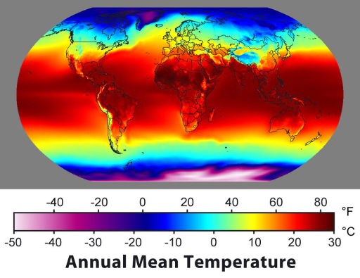

title: Planetary Biome Generation
---

# Planetary Biome Generation
### Bryce Campbell

\
&nbsp;
\
&nbsp;

|  |  |  |
| ----------------------------------- | ------------------------------------ | ------------------------------------------------- |

\
&nbsp;

The goal of this project is to generate procedural earth-like planets through mathematical modeling of their physical properties. The primary focus of the work is on biome generation from climate and precipitation models.

\
&nbsp;

## Step 1: Making a sphere

The first step towards any planet is a sphere. In order to create my sphere I decided to build a simple cube with just 8 vertices. I then subdivided the cube with a tesselation shader and normalized each vertex (setting them to be the same distance from the center) in the tesselation evaluation shader. This resulted in the nice subdivided sphere you can see below.

\
&nbsp;

|  |  |  |
| ----------------------------------- | ------------------------------------ | ------------------------------------------------- |

\
&nbsp;

## Step 2: Terrain

\
&nbsp;

Next up is to vary the surface of our planet with some terrain. I used a simple heigh function for the terrain that simply adds multiple levels of simplex noise together to create planet like mountains and valleys. Simplex noise is a well known smooth noise function, its output is displayed below as well as an example of layered noise. Finally I simply added the noise values to the height of each point on the sphere to get a bumpy asteroid.

|  |  |  |
| ----------------------------------- | ------------------------------------ | ------------------------------------------------- |

\
&nbsp;

## Step 3: The planets surface

Now lets turn this bumpy rock into a real planet. We set a water level that the terrain cannot sink beneath and color everything at that level blue. Then we can color the rest of the terrain based on height to get beaches, grassy continents and snowy mountains!

\
&nbsp;

|  |  |
| ----------------------------------- | ------------------------------------ |

\
&nbsp;

## Step 4: Biomes!

Now we get to the meat of the project. The biome generation. To generally determine what biome you’re in you need to know two things. The average temperature, and the average rainfall for that location. Let's take a look at how those things can be calculated.

\
&nbsp;

### Climate

Climate is based on many different factors but the ones I chose to use for this peroject were latitude and height. Locations that are near to a pole and those that are high in elevation will be colder than low lying equatorial regions.

Based on these factors we can generate the climate map seen below and compare it to the average temperatures found here on earth. Red represents warmer temperatures while blue means an area is colder.

|  |  |
| ----------------------------------- | ------------------------------------ |

\
&nbsp;

### Precipitation

Precipitation is an incredibly difficult value to calculate, however it can be estimated in a realistic fashion. Two main factors that impact average precipitation in an area are: 
1. Temperature (cold air can hold less moisture) 
2. Topography of the area (Locations down wind of mountains will receive less rain because most of the water in the clouds fell over the mountain).

luckily we just got done calculating the average temperature and so that value is ready to be used here.

The prevailing wind direction is something we don't yet have though. 🙁

Trade winds are largely driven by cool air that comes off the poles and makes its way to the equator where it is heated and cycled back. This Cycling behavior form the stratified winds you can see in the diagram below. Near the equator are easterly trade winds. and near the north and south poles are the westerlies. The directions of these winds are determined by the earths rotation also known as the coriolis effect.

In order to simulate this stratification I used sin and cosine functions to oscilate from -1 (westerly wind) to 1 (easterly wind) I then multiplied the result by 1 or -1 depending on the direction of the planets spin and used the same technique to get the vertical component of the wind direction. The resulting wind map can be seen below with red representing easterly wind and green representing westerly wind. Different shades of color in the northern and southern hemisphere are due to the differences in the vertical component of the wind.

\
&nbsp;

#### Building the precipitation map.

To build the precipitation map I begin with the climate map. Then I subtract the height from a position offset by the wind direction. This means that areas that are down wind of a mountain will see lower precipitation than those down wind of flat areas or the ocean. The final result can be seen below on the right with blue representing higher levels of precipitation and red representing dryer areas. On the left we can see the average precipitation on earth.

|  |  |
| - | - |

\
&nbsp;

## Step 5: Biome mapping

Now that we have all these calculations complete we can use the climate and precipitation values to sample a texture. I created the texture seen below on the right based loosely on  Robert Whittaker's biome classification chart seen below on the left. 

|  |  |
| - | - |

\
&nbsp;

## Step 6: Putting it all together

This is the last step! All we have to do is render the sphere with the terrain, and color it based on out calculated biome...

\
&nbsp;

## Sources

Biomes: [National Geographic](https://www.nationalgeographic.org/encyclopedia/biome/#:~:text=A%20biome%20is%20a%20large,forest%2C%20desert%2C%20and%20tundra._) and [another article](https://www.nationalgeographic.org/article/what-makes-biome/)

Climate: [Encyclopedia Britannica](https://www.britannica.com/science/climate-meteorology/World-distribution-of-precipitation)

Prevailing Winds: [Weather.gov](https://www.weather.gov/source/zhu/ZHU_Training_Page/winds/Wx_Terms/Flight_Environment.htm) and [Wikipedia 😳](https://en.wikipedia.org/wiki/Prevailing_winds)
